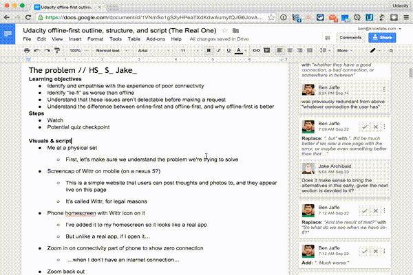

## Features

Night Mode for Google Docs



## Install Instructions

Visit the [Awesomizer Plugin Page](about:blank), and click the Install link (upper left, says "FREE"). The Awesomizer will load on pages from now going forward.

## Instructions for Adding Features

You need to do the following to prepare your environment. You should only need to do these steps once:

0. Clone the repo! (in this example, I'm putting the code in ~/Sites, and using the default name, "Awesomizer")
    
    ```bash
    cd ~/Sites
    git clone "https://github.com/benjaffe/Awesomizer"
    ```
    
1. Install dependencies and run the build task so it starts watching

    ```bash
    cd Awesomizer
    npm install
    ```
    
2. Build the plugin

    ```bash
    grunt
    ```
    
3. Load the plugin in Chrome
    1. Window - Extensions - Developer Mode - Load unpacked extension
    2. Choose the folder: ~/Sites/Awesomizer/build/unpacked-dev
    3. You should see the plugin loaded at the top of the list.
    4. If you have the normal Awesomizer installed already, scroll down until you find it, and uncheck the checkbox to disable it.


Now you can start developing! Here's how:

1. In `code/js/background.js`, add an entry to the `defaultFeatures` array at the top, following the pattern below:
    ```js
    {
        // This is the feature's full name
        name:  'Google Docs Night Mode',
    
        // This is the name of the service you affect
        service:  'Google Docs',
    	
        // This serves as the storage key, and the file name for your feature's 
        // entry point (ex. docsNightMode, which means your main JS file is
        // named docsNightMode.js).
        shortName:  'docsNightMode',
    
        // This is the description that users see in the wplugin dropdown. It 
        // should explain what the plugin does. Try to make it clear, but concise.
        description:  'Night mode for Docs, so your eyes don\'t become bleary from reading docs late into the night.',
    
        // This optional string is displayed in a more subdued way than the 
        // description, and is intended for usage notes for the user.
        note: '...or perhaps you should go to bed earlier',
    
        // This boolean dictates whether the feature is enabled by default when it 
        // first loads. Users can always change the enabled state from the dropdown 
        // menu (if they remember that they can).
        enabled: false,
    
        // This object is for storing settings related to your plugin. See 
        // footnote 0 in this README.
        settings: {}  
    }
    ```

2. In the `code/js/features/` folder, make a copy of the `template` folder.
   Rename it (and the js file inside) to the short name of your feature (ex. `docsNightMode`).
   Open the `.js` file, and write your code where it says `//YOUR CODE HERE`. If you have CSS files, uncomment the cssFiles array (in the first few lines of the file), and add any CSS file names (relative paths to the directory of the JS file).

3. Register your plugin code by opening `code/manifest.json` and adding an entry in 
   the `content_scripts` section. You'll need to specify a URL pattern that the feature should run on, and the JS files that you want to execute. Remember not to specify CSS files here -- those should have been specified above in Step 2.
   
4. Build the plugin using the instructions below.


### Build instructions:

```bash
cd ~/Sites/Awesomizer
grunt start
```

...and after you run `grunt start` for the first time, it should watch for changes and rebuild automatically


*Footnote 0: Regarding the settings object: Currently, this object is not guaranteed to work, and handling of it has not been tested at all. In other words, use at your own peril. If your plugin applies to a single website, you can store settings in localStorage instead.*


-----------------------------------------------------------------------

### Original README text

Below is the original README text for the skeleton that this plugin is based upon. The information below is potentially out of date or not applicable to this project, so treat it with appropriate caution if you read it.

-----------------------------------------------------------------------


## Skeleton for Google Chrome extensions

* includes awesome messaging module
* grunt-based build system
* node.js modules
* unit-tests in mocha
* CircleCI friendly

### Installation:

    git clone git@github.com:salsita/chrome-extension-skeleton.git
    
    # in case you don't have Grunt yet:
    sudo npm install -g grunt-cli

### Build instructions:

    cd chrome-extension-skeleton
    npm install
    grunt

### Directory structure:

    /build             # this is where your extension (.crx) will end up,
                       # along with unpacked directories of production and
                       # develop build (for debugging)
    
    /code
        /css           # CSS files
        /html          # HTML files
        /images        # image resources
    
        /js            # entry-points for browserify, requiring node.js `modules`
    
            /libs      # 3rd party run-time libraries, excluded from JS-linting
            /modules   # node.js modules (and corresponding mocha
                       #   unit tests spec files)
    
        manifest.json  # skeleton manifest file, `name`, `description`
                       #   and `version` fields copied from `package.json`
    
    Gruntfile.js       # grunt tasks (see below)
    circle.yml         # integration with CircleCI
    crxmake.sh         # official build script for packing Chromium extensions
    mykey.pem          # certificate file, YOU NEED TO GENERATE THIS FILE, see below
    lint-options.json  # options for JS-linting
    package.json       # project description file (name, version, dependencies, ...)

### Grunt tasks:

* `clean`: clean `build` directory
* `test`: JS-lint and mocha test, single run
* `test-cont`: continuos `test` loop
* default: `clean`, `test`, build step (copy all necessary files to `build`
  directory, browserify JS sources, prepare production version (using uglify),
  pack the `crx` (using official shell script), and copy the resulting `crx` to
  CircleCI artifacts directory (only when on CircleCI))

### After you clone:

1. In `package.json`, rename the project, description, version, add dependencies
and any other fields necessary.

2. Generate your .pem key and store it in the root as `mykey.pem` file. On
unix / mac, the command to generate the file is
`openssl genrsa 2048 | openssl pkcs8 -topk8 -nocrypt > mykey.pem`.
Note: the generated file is in `.gitignore` file, it won't be (and should NOT
be) commited to the repository unless you know what you are doing.

3. Add content (HTML, CSS, images, JS modules), update `code/manifest.json`,
leave only JS entry-points you use (remove the ones you don't need).

4. When developing, write unit-tests, use `test-cont` Grunt task to check that
your JS code passes linting tests and unit-tests.

5. When ready to try out the extension in the browser, use default Grunt task to
build it. In `build` directory you'll find develop version of the extension in
`unpacked-dev` subdirectory (with source maps), and production (uglified)
version in `unpacked-prod` directory. The `.crx` packed version is created from
`unpacked-prod` sources.

6. When done developing, publish the extension and enjoy it (profit!).

Use any 3rd party libraries you need (both for run-time and for development /
testing), place them either to `code/js/libs`, in case the library is not an npm
module, or use regular npm node.js modules (that will be installed into
`node_modules` directory). These libraries will be encapsulated in the resulting
code and will NOT conflict even with libraries on pages where you inject the
resulting JS scripts to (for content scripts).

For more information, please check also README.md files in subdirectories.

### Under the hood:

If you want to understand better the structure of the code and how it really
works, please check the following sources:

* [introductory blog post](https://blog.javascripting.com/2014/06/18/the-chrome-extension-skeleton-building-modular-extensions-with-grunt-and-browserify/),
* [blog post on messaging system](https://blog.javascripting.com/2014/08/11/the-chrome-extension-skeleton-messaging-system/),
* or this [overall prezi](http://prezi.com/yxj7zs7ixlmw/chrome-extension-skeleton/).

### Legacy version

Before this version of the skeleton, we used [RequireJS](http://requirejs.org/)
modules, [jasmine-based](http://jasmine.github.io/) unit tests and older
`chrome.extension.{onMessage|sendMessage}` API for message exchange between
background and content scripts. This version is still available in
[legacy](https://github.com/salsita/chrome-extension-skeleton/tree/legacy)
branch here.
